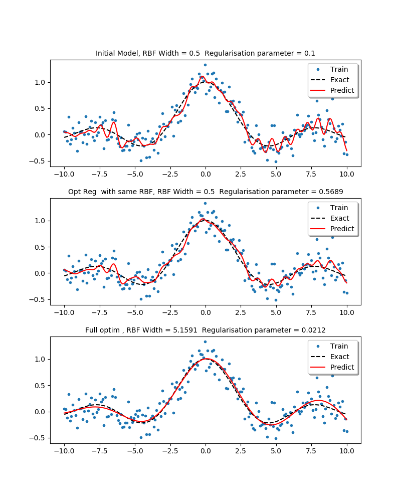
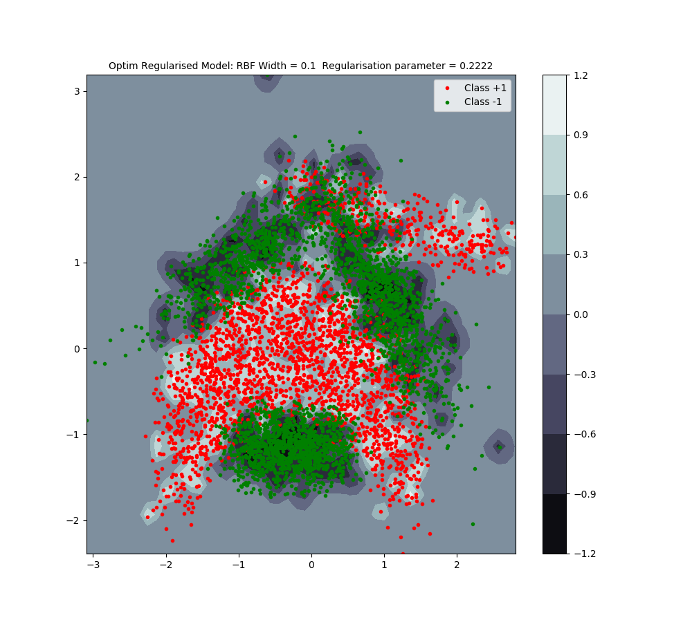
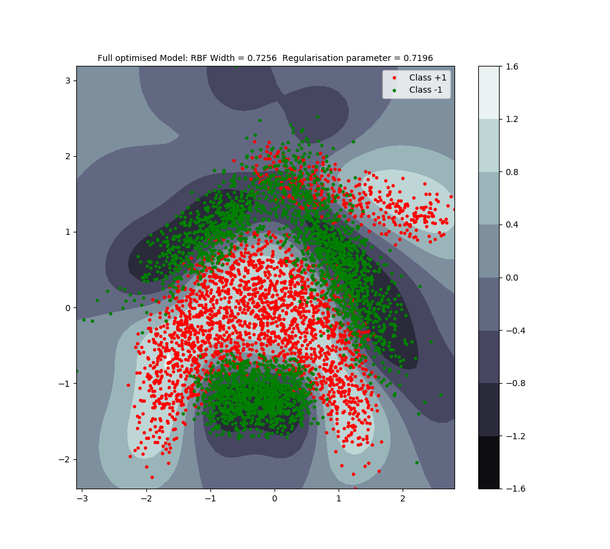

# Optimally Regularised Least Squares Support Vector Machine
This is a fast tuned  Least Squares Support Vector Machines (LSSVM), the cost of regularisation is O(n^2)   (please see reference below).\
[1] Optimally regularised kernel Fisher discriminant classification, DOI: 10.1016/j.neunet.2007.05.005

## Regression 

## Classification 
Banana dataset, n = 5300, only 10% (530) is used in the training.

